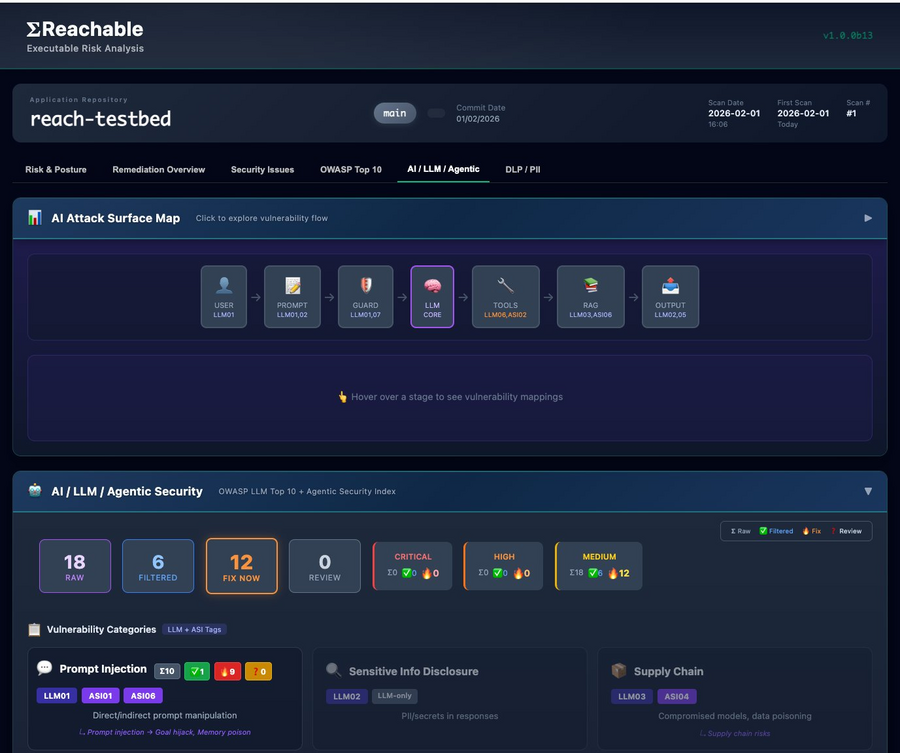

# REACHABLE

Security scanner that shows which vulnerabilities are actually reachable through your code.

## Dashboard

<p align="center">
  
</p>

The interactive dashboard shows scan results across six tabs: Risk & Posture, Remediation Overview, Security Issues, OWASP Top 10, AI/LLM/Agentic, and DLP/PII. The AI Attack Surface Map visualizes the full LLM pipeline — from user input through prompt guards, model core, tool use, RAG, and output — mapping OWASP LLM Top 10 and Agentic Security Index findings to each stage.

## Install

This is a **private repository**. All options require GitHub access with `repo` scope.
Create a Personal Access Token (Classic) at https://github.com/settings/tokens with `repo` scope enabled.

### Option 1: Clone and run

```bash
git clone https://github.com/sthenos-security/reach-dist.git
cd reach-dist
./install.sh
```

Uses your existing git credentials (SSH key or credential helper).

### Option 2: curl with token (no clone needed)

```bash
export GITHUB_TOKEN="ghp_your_token_here"
curl -H "Authorization: token $GITHUB_TOKEN" \
     -H "Accept: application/vnd.github.v3.raw" \
     -sL https://api.github.com/repos/sthenos-security/reach-dist/contents/install.sh | bash
```

The `GITHUB_TOKEN` here authenticates to the GitHub API to download `install.sh` from this private repo. It also needs `repo` scope so the installer can download wheels.

### Option 3: Local wheel install

Download `install.sh` and a wheel manually (e.g. from the GitHub web UI), then:

```bash
chmod +x install.sh
./install.sh --wheel ./wheels/v1.0.0b14/reachable-1.0.0b14-cp314-cp314-macosx_10_15_universal2.whl
```

No token needed if you already have the files.

The installer creates an isolated virtual environment at `~/.reachable/venv` and handles all dependencies.

## Setup

Add REACHABLE to your PATH (the installer will prompt, or add manually):

```bash
# Add to ~/.zshrc or ~/.bashrc
export PATH="$HOME/.reachable/venv/bin:$PATH"
source ~/.zshrc  # or ~/.bashrc
```

Set up a GitHub token for cloning vulnerable library source during reachability analysis:

```bash
# Add to ~/.zshrc or ~/.bashrc
export GITHUB_TOKEN="ghp_your_token_here"
```

Required scope: `repo` — create at https://github.com/settings/tokens

Token priority (first found wins): `MCP_GITHUB_TOKEN` → `GITHUB_TOKEN` → `GH_TOKEN` → SSH key. If you have a working MCP GitHub token, REACHABLE will use it for cloning. Without any token, public repos work (rate-limited) but private repos will fail.

Verify your git client and GitHub access:

```bash
reachctl doctor
```

## Get Started

```bash
reachctl primer              # Quick-start guide
reachctl --help              # All commands
reachctl scan --help         # Scan options
```

## Quick Scan

```bash
reachctl scan /path/to/your/repo
reachctl dashboard open      # View results
```

## Upgrade

```bash
./install.sh                 # Re-run to upgrade (uses --force-reinstall)
```

## Uninstall

```bash
rm -rf ~/.reachable
```

## Verify Signatures

All wheels are signed with [Sigstore](https://sigstore.dev) cosign. See [VERIFICATION.md](VERIFICATION.md) for details.

```bash
brew install cosign
cosign verify-blob \
    --bundle reachable-*.whl.cosign.bundle \
    --certificate-identity-regexp="https://github.com/sthenos-security/reach-core/.*" \
    --certificate-oidc-issuer="https://token.actions.githubusercontent.com" \
    reachable-*.whl
```

## Language & Build System Support

| Language | Reachability | Dependency Scanning | Build Systems |
|----------|:---:|:---:|---|
| Python | ✅ | ✅ | pip, Poetry, Pipenv |
| JavaScript | ✅ | ✅ | npm, Yarn, pnpm |
| TypeScript | ✅ | ✅ | npm, Yarn, pnpm |
| Go | ✅ | ✅ | go mod |
| Java | ✅ | ✅ | Maven, Gradle |
| Kotlin | ✅ | ✅ | Gradle, Maven |
| Scala | ✅ | ✅ | Gradle |
| Groovy | ✅ | ✅ | Gradle |
| Rust | — | ✅ | Cargo |
| Ruby | — | ✅ | Bundler |
| C/C++ | — | — | — |
| C#/.NET | — | — | NuGet |
| PHP | — | — | Composer |
| Swift/Obj-C | — | — | CocoaPods, SPM |
| Dart/Flutter | — | — | pub |
| Elixir/Erlang | — | — | Mix/Hex |

✅ = supported, — = not yet supported

**Reachability** = call graph + import tracking to determine if a vulnerability is actually reachable through your code paths.
**Dependency Scanning** = SBOM generation, CVE matching, and threat intelligence (CISA KEV, EPSS) — no call graph analysis.

**Not yet supported:** Bazel, SBT, CMake, Meson, Buck, multi-repo/monorepo orchestration (Lerna, Nx, Turborepo).

## Requirements

- Python 3.10–3.14
- macOS or Linux (x86_64 / ARM64)
- git client

## Support

adazzi@sthenosec.com

---

© 2026 Sthenos Security. All rights reserved.
